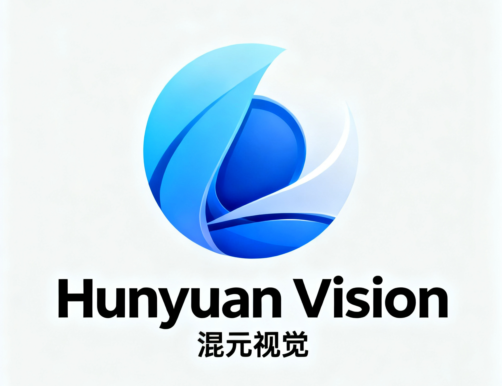

<p align="center">



</p>


<p align="center">
📑🤗 Paper & Weights are coming &nbsp&nbsp | &nbsp&nbsp 💻 <a href="https://cloud.tencent.com/document/product/1729/104753">API</a>&nbsp&nbsp | &nbsp&nbsp 💭 <a href="https://lmarena.ai/?mode=direct">Direct Chat @ LMArena</a>&nbsp&nbsp
</p>


We are excited to introduce Hunyuan-Vision-1.5, a mamba-transformer hybrid architecture vision-language model that offers advanced multilingual multimodal understanding and reasoning capabilities. 


## News

- **October 6, 2025**: **hunyuan-vision-1.5-thinking** <a href="https://x.com/arena/status/1975257734053503260">ranked 3rd on LmArena</a>, the best performing model in China.
  
<div style="max-height:50px; overflow-y:auto;">

  

</div>


## 📑 Open-source Plan

- Hunyuan-Vision-1.5 (vision language model)
  - [ ] Hunyuan-Vision-1.5 Technical Report
  - [ ] Hunyuan-Vision-1.5 Checkpoints (A56B, 4B)
  - [ ] Hunyuan-ViT-V1 Checkpoints
  - [ ] TRT Inference Support
  - [ ] "Thinking on Images" Support
  - [ ] VLLM Support
  
## Highlights

⚙️ **Hybrid Architecture:** With a novel mamba-transformer hybrid architecture, Hunyuan-Vision-1.5 achieves state-of-the-art performance on multimodal understanding tasks while delivering highly efficient inference. 

🧩 **Advanced "Thinking-on-Image" Reasoning:** Beyond strong and robust multimodal reasoning, Hunyuan-Vision-1.5 offers more advanced thinking-with-image capabilities that support deeper multimodal understanding and reasoning with a novel visual reflection paradigm.

🌐 **Versatility:** Hunyuan-Vision-1.5 excels across various tasks from image and video understanding to more advanced tasks such as visual reasoning and 3D spatial comprehension. It also offers a seamless, multilingual user experience across real-world applications, ensuring smooth performance across languages and diverse task contexts.

We will open-source Hunyuan-Vision-1.5. The model and technical report will be released in late October. Stay tuned for more updates! 


## Quickstart


Hunyuan-Vision-1.5 is now available at [Tencent Cloud](https://cloud.tencent.com/document/product/1729/104753). You are welcome to try our most advanced model right now. ("Thinking on Images" mode will be available later)


```python

from openai import OpenAI

# set your Tencent Cloud API key here

API_KEY = ""


client = OpenAI(

    api_key=API_KEY,

    base_url="https://api.hunyuan.cloud.tencent.com/v1",

)


MODEL_NAME = 'hunyuan-t1-vision-20250916'


completion = client.chat.completions.create(

    model=MODEL_NAME,

    messages=[

        {"role": "user", "content": [{"type": "image_url","image_url": {"url": "https://dscache.tencent-cloud.cn/upload/uploader/hunyuan-64b418fd052c033b228e04bc77bbc4b54fd7f5bc.png"}},{"type": "text", "text": "What is it?"},]}]

)


print(completion.choices[0])

```


Our model is also available on [LMArena Direct Chat](https://lmarena.ai/?mode=direct). You can try it out by selecting `hunyuan-vision-1.5-thinking` from the model list in Direct Chat. 


## Model Capabilities


### Multimodal Understanding


Hunyuan-Vision-1.5 is a vision-language model designed for general-purpose multimodal understanding and reasoning. It excels across various tasks from image and video recognition, OCR, diagram understanding to more advanced tasks such as visual reasoning and 3D spatial comprehension.


<div style="max-height:500px; overflow-y:auto;">

  

</div>


### Multilingual 

We aim to offer a seamless, multilingual user experience across real-world applications, ensuring smooth performance across languages and diverse task contexts. You can try our model using your preferred language.


<div style="max-height:500px; overflow-y:auto;">

  

</div>


### Advanced Multimodal Thinking


Hunyuan-Vision-1.5 offers more advanced thinking-with-image capabilities that support deeper multimodal understanding and reasoning with a "thinking on images" paradigm. Our model is optimized to use various extra tools to help the thinking process by modifying input images (crop/zoom-in, drawing points/lines/boxes, etc.) or acquiring additional knowledge via web search.


<div style="max-height:500px; overflow-y:auto;">

  

</div>
